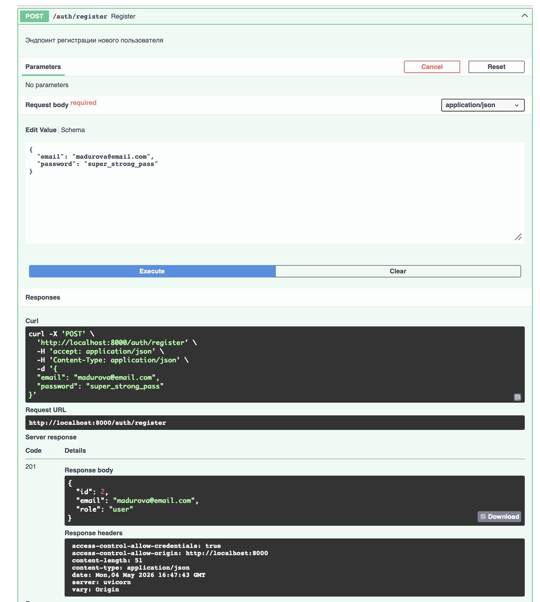
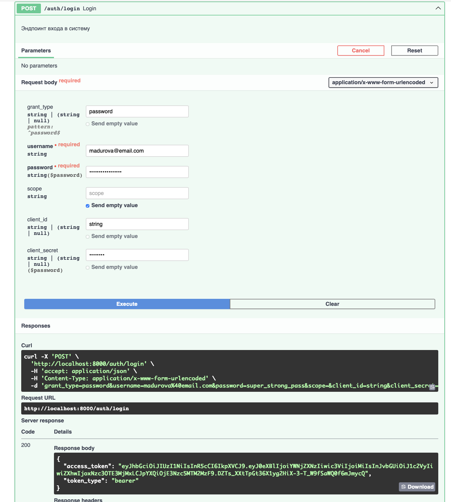
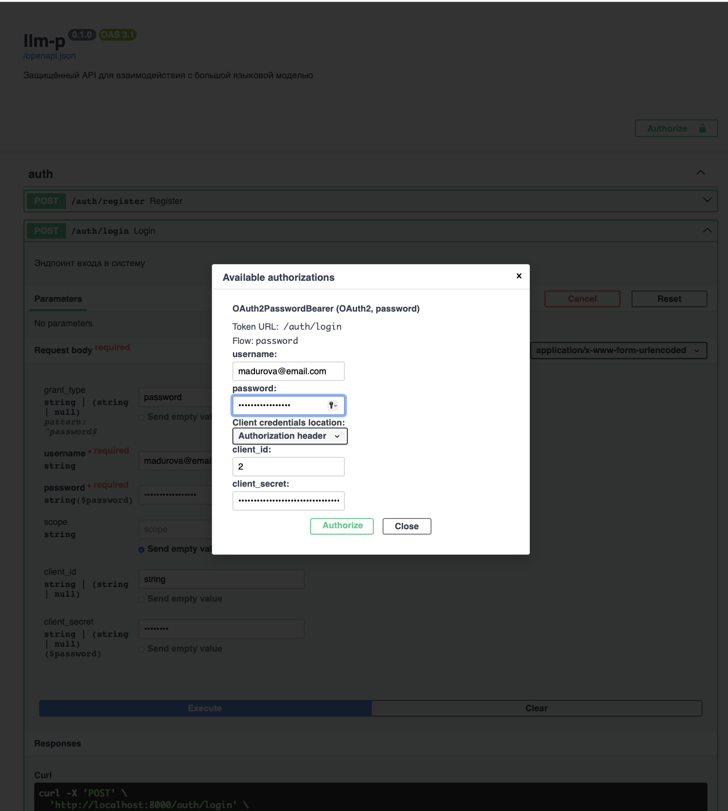
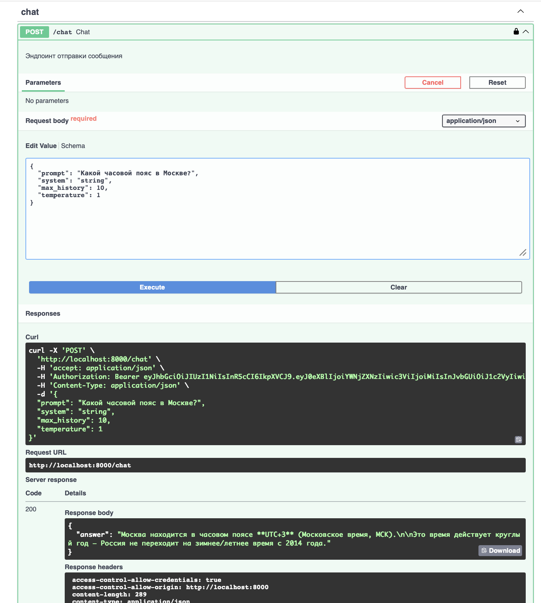
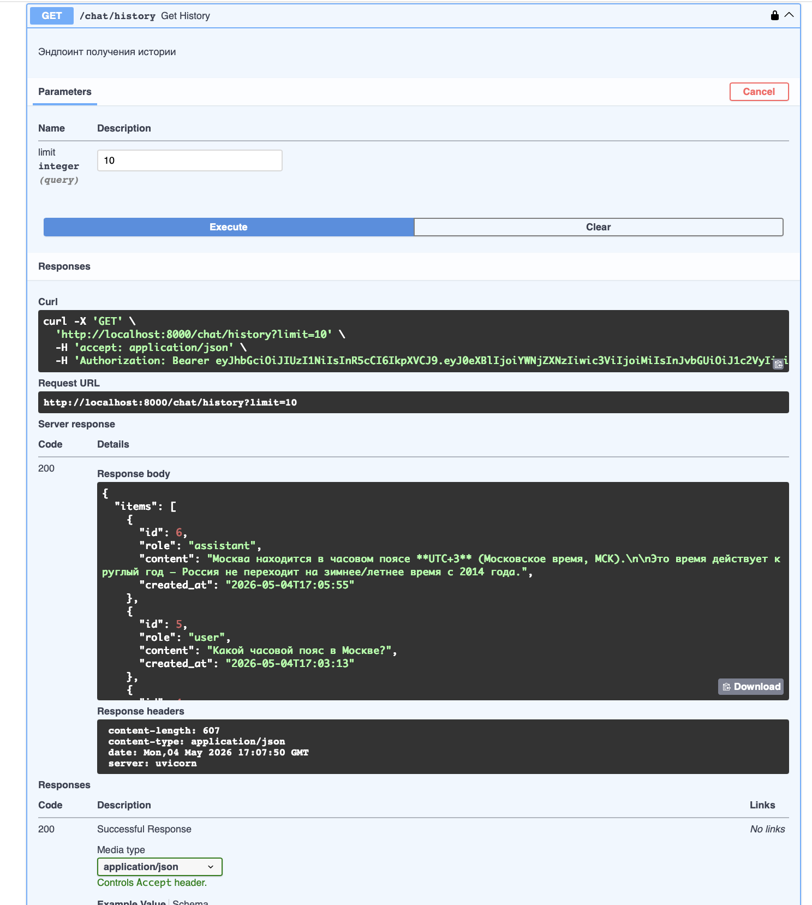

# Защищённый API для работы с большой языковой моделью

## Установка и запуск

Установка и запуск приложения производятся с помощью пакетного менеджера uv

Установка uv:
```pip install uv```

Создание и запуск виртуального окружения:

```
uv venv
source .venv/bin/activate # MacOS/Linux
.venv\Scripts\activate.bat # Windows
```

Запуск приложения:
```
uv run uvicorn app.main:app --reload --host 0.0.0.0 --port 8000
```
Интерфейс Swagger UI доступен по ссылке [http://localhost:8000/docs](http://localhost:8000/docs)

Статус сервиса можно проверить по ссылке [http://localhost:8000/health](http://localhost:8000/health)

## Пример работы

Регистрация пользователя с email madurova@email.com:




Авторизация по паролю и получение токена:



Авторизация с полученным токеном через интерфейс Swagger:



Авторизация с полученным токеном через интерфейс Swagger (результат):


Запрос и ответ модели:



История запросов:



